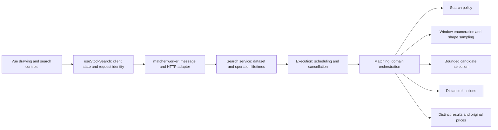

# Architecture

Stock Drawer is a static application with a small domain core. A sketch becomes immutable coordinates; a worker searches local history; the UI replays the original observations. There is no prediction service or server-side database.

## Responsibilities and contracts

| Module | Owns | Does not own |
| --- | --- | --- |
| `shared/types.ts` | Data and worker-message contracts | Framework state or behavior |
| `shared/importer.ts`, `shared/candles.ts` | Validation, CSV conversion, candle calculations | Fetching or UI |
| `app/lib/shape.ts`, `drawing.ts` | Shape normalization and immutable capture | Search scheduling |
| `app/lib/search/policies.ts` | Search budgets and starting-date stride | Mode-dependent UI |
| `app/lib/search/windows.ts` | Window enumeration, interpolation, gap rejection | Scoring or ranking |
| `app/lib/search/candidates.ts` | Bounded shortlist and stock diversity | Data loading or final DTW ranking |
| `app/lib/search/scoring.ts` | Direct distance and constrained DTW | Candidate selection |
| `app/lib/search/results.ts` | Distinct-stock ranking and original observations | Chart rendering |
| `app/lib/matching.ts` | Compose the search stages | HTTP, Vue, DOM or worker globals |
| `app/lib/search/execution.ts` | Cooperative scheduling, progress, cancellation | Dataset acquisition |
| `app/workers/search-service.ts` | Dataset and request lifetimes | HTTP or worker APIs |
| `app/workers/matcher.worker.ts` | Bind the service to browser I/O | Matching rules |
| `app/composables/useStockSearch.ts` | Vue state, browser worker lifecycle, latest-request checks | Search implementation |
| `SearchDepthControl.vue`, `SearchProgress.vue` | Accessible controls and progress display | Search work |

The synchronous and asynchronous entry points consume the same generator. There is one algorithm, not two implementations that can drift. The generator pauses after at most 2,048 attempted windows, after each stock, and periodically during reranking. The async runner releases the worker event loop around a 12 ms budget; a chunk can exceed that budget on a slow device. This is cooperative scheduling, not a hard real-time guarantee.

## SOLID in practice

- **Single responsibility:** parsing, selecting candidates, scoring, scheduling, transport, lifecycle management, and presentation have separate reasons to change.
- **Open/closed:** the matcher consumes search-policy values; changing a search budget does not require editing worker transport or scoring. Adding a named mode requires explicitly extending the typed public contract and its UI.
- **Liskov substitution:** Quick and Deep honor the same result guarantees: original chronological observations, finite distances, gap exclusion, flat-pattern rules, and distinct stocks. Injected search runners honor progress/cancellation/error contracts. No inheritance hierarchy is needed.
- **Interface segregation:** the service receives only a loader, publisher, and search runner. The runner receives only a signal, progress callback, and scheduler. Domain helpers do not depend on broad application services.
- **Dependency inversion:** the worker application service depends on function contracts; the outer adapter supplies fetch and postMessage. Integration tests use real parsing/search with controlled I/O and scheduling.

Prefer explicit functions and composition over speculative abstractions. `CandidatePool` is a class because it owns bounded mutable selection state, not because every concept needs a class. These boundaries are covered by tests and documented in `AGENTS.md` for future changes.

## Search depth and quality

Quick examines starts every five observations plus the final complete window and reranks up to 200 candidates. Deep examines every start and reranks up to 1,000 candidates, plus Quick's finalists after diversity selection (at most 1,200 unique candidates). Both normalize to 64 points and use a DTW band of six samples.

Deep builds the Quick pool during the same traversal. Unioning finalists before DTW preserves the complete Quick candidate set: increasing candidate density cannot crowd out a Quick winner. For identical data and sketches, each available top-five ranked distance is therefore no worse than Quick's. This does not guarantee a visibly better result or the globally optimal match; both modes still shortlist by direct distance.

Progress reports actual stocks/windows checked. A full stock progress bar means scanning finished; the status changes to comparing finalists while reranking completes. Cancel aborts the current operation and returns to the drawing. New searches or data loads supersede old work. The service suppresses stale progress/results/errors, and the Vue client also checks request IDs. Late network replies cannot restore an old dataset.

## Tradeoffs

Deep uses more CPU and is opt-in; Quick remains the default. Memory holds bounded candidate lists and one best candidate per stock, not every historical window. More sampling points would not create new prices. Larger historical datasets still need verified redistribution rights. CSV parsing remains synchronous inside the worker; search cancellation does not interrupt an import already parsing. Missing dates are judged against the observed union calendar, whose limitations remain documented in the provenance review.
